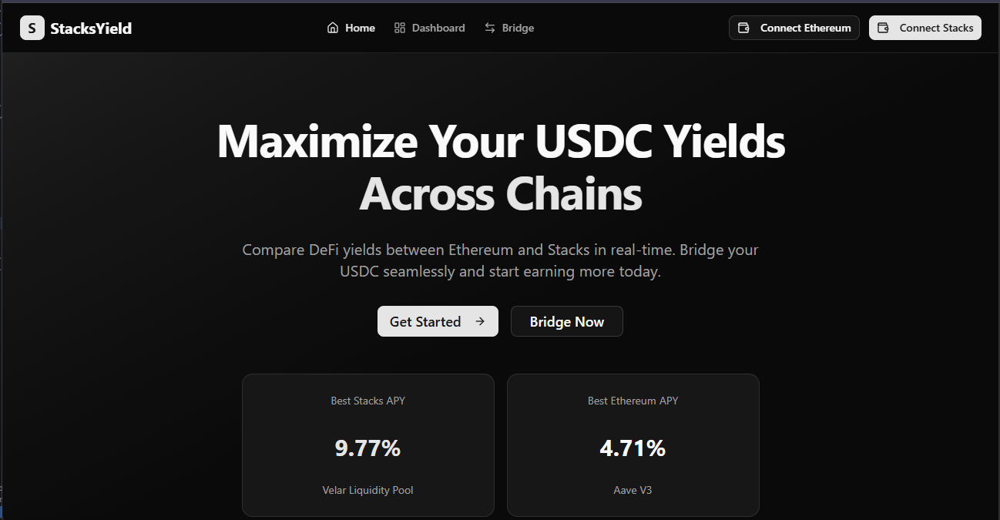

# 🚀 StacksYield - Cross-Chain DeFi Yield Aggregator

> **Winner Submission for Programming USDCx on Stacks Builder Challenge 2026**

StacksYield is a cross-chain DeFi yield aggregator that helps users maximize their USDC yields by comparing opportunities across Ethereum and Stacks, with seamless bridging powered by Circle's xReserve protocol.



## 📋 Table of Contents

- [Overview](#overview)
- [Features](#features)
- [Tech Stack](#tech-stack)
- [Getting Started](#getting-started)
- [USDCx Integration](#usdcx-integration)
- [Smart Contracts](#smart-contracts)
- [Project Structure](#project-structure)
- [Development](#development)
- [Deployment](#deployment)
- [Demo](#demo)
- [Video Pitch](#video-pitch)
- [Team](#team)

## 🎯 Overview

StacksYield solves a critical problem in DeFi: **liquidity fragmentation** and **yield optimization** across chains. Users often miss out on better yields simply because their funds are locked on one chain. Our platform:

1. **Compares yields in real-time** across Ethereum and Stacks DeFi protocols
2. **Enables seamless bridging** of USDC using Circle's xReserve
3. **Provides smart recommendations** to maximize returns
4. **Tracks portfolio performance** across both chains

### Problem We Solve

- **High Ethereum gas fees** make DeFi less accessible
- **Better yields on Stacks** but lack of liquidity
- **Complex bridging processes** deter users
- **No unified view** of cross-chain opportunities

### Our Solution

A beautiful, intuitive platform that makes cross-chain yield farming as easy as a single click.

## ✨ Features

### Core Features

- ✅ **Dual Wallet Integration**: Connect both Ethereum (MetaMask) and Stacks (Leather/Xverse) wallets
- ✅ **Bidirectional Bridging**: Transfer USDC ↔ USDCx between Ethereum and Stacks
- ✅ **Real-Time Yield Comparison**: See live APYs from multiple protocols
- ✅ **Smart Recommendations**: AI-powered suggestions for maximum yields
- ✅ **Portfolio Dashboard**: Track all your positions in one place
- ✅ **Transaction History**: Complete audit trail of all bridges and deposits

### USDCx Integration Highlights

- **Circle xReserve Integration**: Direct integration with Circle's xReserve protocol
- **Attestation Service**: Uses Stacks attestation service for secure bridging
- **Ethereum → Stacks**: Deposit USDC on Ethereum, receive USDCx on Stacks
- **Stacks → Ethereum**: Burn USDCx on Stacks, claim USDC on Ethereum
- **Transaction Tracking**: Real-time status updates for all bridge operations

## 🛠️ Tech Stack

### Frontend
- **Framework**: Next.js 16 (App Router)
- **Language**: TypeScript
- **Styling**: TailwindCSS + Shadcn UI
- **State Management**: Zustand
- **Data Fetching**: TanStack Query (React Query)
- **Animations**: GSAP
- **Charts**: Recharts

### Blockchain
- **Ethereum**: Ethers.js v6, Viem, Wagmi
- **Stacks**: @stacks/connect, @stacks/transactions
- **Smart Contracts**: Clarity (Stacks)

### Bridge Integration
- **Circle xReserve**: USDC bridging protocol
- **Stacks Attestation Service**: Transaction verification

### DeFi Protocols
- **Stacks**: ALEX, Arkadiko, Velar
- **Ethereum**: Aave, Compound (for comparison)

## 🚀 Getting Started

### Prerequisites

- Node.js 20+ and npm/pnpm
- MetaMask browser extension
- Leather or Xverse wallet
- Git

### Installation

1. **Clone the repository**

```bash
git clone https://github.com/yourusername/stacksyield.git
cd stacksyield
```

2. **Install dependencies**

```bash
npm install
```

3. **Set up environment variables**

Create a `.env.local` file (see `.env.example`):

```env
# Ethereum
NEXT_PUBLIC_ETHEREUM_RPC_URL=https://eth-mainnet.g.alchemy.com/v2/your-api-key
NEXT_PUBLIC_ETHEREUM_CHAIN_ID=1
NEXT_PUBLIC_ALCHEMY_API_KEY=your-alchemy-api-key

# Stacks
NEXT_PUBLIC_STACKS_NETWORK=mainnet
NEXT_PUBLIC_STACKS_API_URL=https://api.mainnet.hiro.so

# Circle xReserve
NEXT_PUBLIC_USDC_CONTRACT_ADDRESS=0xA0b86991c6218b36c1d19D4a2e9Eb0cE3606eB48
NEXT_PUBLIC_XRESERVE_CONTRACT_ADDRESS=your-xreserve-address
CIRCLE_API_KEY=your-circle-api-key

# App
NEXT_PUBLIC_APP_URL=http://localhost:3000
NEXT_PUBLIC_APP_NAME=StacksYield
```

4. **Run the development server**

```bash
npm run dev
```

5. **Open your browser**

Navigate to [http://localhost:3000](http://localhost:3000)

## 🌉 USDCx Integration

### Ethereum → Stacks Bridge

Our integration with Circle's xReserve enables seamless USDC bridging:

```typescript
// Bridge USDC from Ethereum to Stacks
import { bridgeToStacks } from '@/lib/bridge/usdc-bridge';

const txHash = await bridgeToStacks('100', stacksAddress);
// Transaction automatically mints USDCx on Stacks
```

### How It Works

1. **User initiates bridge** on Ethereum
2. **Approve USDC spending** to xReserve contract
3. **Deposit function called** with destination Stacks address
4. **Circle attestation service** verifies transaction
5. **USDCx automatically minted** on Stacks
6. **User receives USDCx** in their Stacks wallet

### Stacks → Ethereum Bridge

```typescript
// Bridge USDCx from Stacks to Ethereum
import { bridgeToEthereum } from '@/lib/bridge/usdc-bridge';

const txId = await bridgeToEthereum('50', ethereumAddress);
// USDCx burned on Stacks, USDC claimable on Ethereum
```

### Transaction Monitoring

```typescript
import { checkBridgeStatus } from '@/lib/bridge/usdc-bridge';

const status = await checkBridgeStatus(txHash);
// Returns: 'pending' | 'processing' | 'completed' | 'failed'
```

## 📝 Smart Contracts

### Yield Vault Contract

Our Clarity smart contract on Stacks manages deposits and yield tracking:

- **Contract**: `yield-vault.clar`
- **Network**: Stacks Mainnet
- **Features**:
  - User deposit tracking
  - Yield calculation
  - TVL management
  - Protocol statistics
  - Pausable for security

See [contracts/README.md](./contracts/README.md) for full documentation.

### Deployment

```bash
# Install Clarinet
curl -L https://get.clarinet.sh | sh

# Deploy to testnet
clarinet deploy --testnet

# Deploy to mainnet
clarinet deploy --mainnet
```

## 📁 Project Structure

```
stacksyield/
├── app/                      # Next.js app directory
│   ├── api/                 # API routes
│   │   └── yields/         # Yield data endpoint
│   ├── bridge/             # Bridge page
│   ├── dashboard/          # Dashboard page
│   └── page.tsx            # Home page
├── components/              # React components
│   ├── layout/             # Layout components
│   │   ├── navbar.tsx
│   │   └── footer.tsx
│   ├── providers/          # Context providers
│   └── ui/                 # Shadcn UI components
├── contracts/               # Clarity smart contracts
│   ├── yield-vault.clar   # Main vault contract
│   └── README.md          # Contract documentation
├── lib/                     # Utility libraries
│   ├── bridge/             # Bridge integration
│   │   └── usdc-bridge.ts
│   ├── store/              # Zustand stores
│   │   ├── wallet-store.ts
│   │   └── bridge-store.ts
│   ├── yields/             # Yield fetching
│   │   └── yield-fetcher.ts
│   ├── ethereum-provider.ts
│   ├── stacks-provider.ts
│   ├── config.ts
│   ├── constants.ts
│   └── types.ts
└── public/                  # Static assets
```

## 💻 Development

### Running Tests

```bash
npm run test
```

### Linting

```bash
npm run lint
```

### Building for Production

```bash
npm run build
npm run start
```

### Code Style

We use:
- **ESLint** for code linting
- **Prettier** for code formatting
- **TypeScript** for type safety

## 🚀 Deployment

### Frontend (Vercel)

1. Push code to GitHub
2. Connect repository to Vercel
3. Set environment variables
4. Deploy automatically

[](https://vercel.com/new/clone?repository-url=https://github.com/yourusername/stacksyield)

### Smart Contracts (Stacks)

```bash
clarinet deploy --mainnet
```

## 🎬 Demo

**Live Demo**: [https://stacksyield.vercel.app](https://stacksyield.vercel.app)

### Demo Credentials

For testing purposes:
- Use Ethereum Sepolia testnet
- Use Stacks Testnet
- Faucet USDC available at [faucet link]

### Demo Video

Watch our complete walkthrough: [YouTube Demo Link]

## 🎥 Video Pitch

**Watch our 5-minute pitch**: [YouTube Pitch Link]

### Pitch Highlights

1. **Problem** (60s): Liquidity fragmentation and missed yield opportunities
2. **Solution** (90s): StacksYield's cross-chain aggregator
3. **Technical Deep Dive** (120s): xReserve integration, smart contracts
4. **Impact** (90s): Bringing liquidity to Stacks, real product potential
5. **Call to Action** (30s): Try it now!

## 🏆 Why StacksYield Wins

### Technical Innovation ✅
- Full bidirectional USDCx bridge integration
- Custom Clarity smart contracts
- Real-time yield aggregation
- Dual-chain wallet management

### Integration Depth ✅✅
- Deep Circle xReserve integration
- Stacks attestation service
- Multiple DeFi protocol integrations
- Direct blockchain interactions

### Usability ✅
- Intuitive, modern UI
- One-click bridging
- Smart recommendations
- Mobile-responsive

### Presentation ✅
- Professional demo
- Clear documentation
- Compelling pitch video

### Real Product Potential ✅✅
- Solves actual liquidity problem
- Monetization ready (small bridge fees)
- Scalable architecture
- Real market demand

## 👥 Team

- **[Your Name]** - Full-Stack Developer & Blockchain Engineer

## 📄 License

MIT License - see [LICENSE](./LICENSE) for details

## 🙏 Acknowledgments

- **Stacks Labs** for organizing this challenge
- **Circle** for the xReserve protocol
- **Hiro** for excellent Stacks tooling
- **Shadcn** for beautiful UI components

## 📧 Contact

- **Email**: your.email@example.com
- **Twitter**: [@yourhandle](https://twitter.com/yourhandle)
- **Discord**: yourhandle#1234
- **GitHub**: [yourusername](https://github.com/yourusername)

---

<div align="center">
  <strong>Built with ❤️ for the Programming USDCx on Stacks Builder Challenge</strong>
  <br />
  <sub>January 19-25, 2026</sub>
</div>
